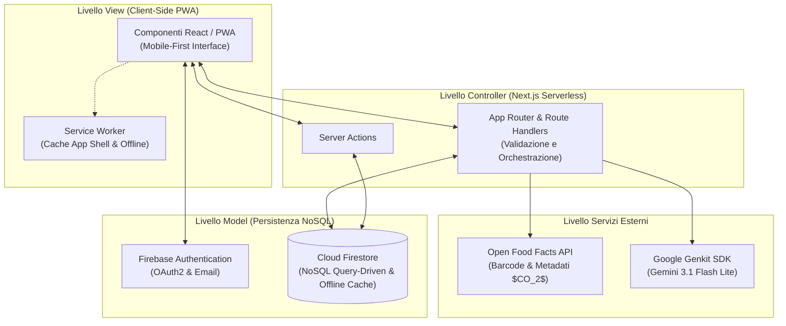
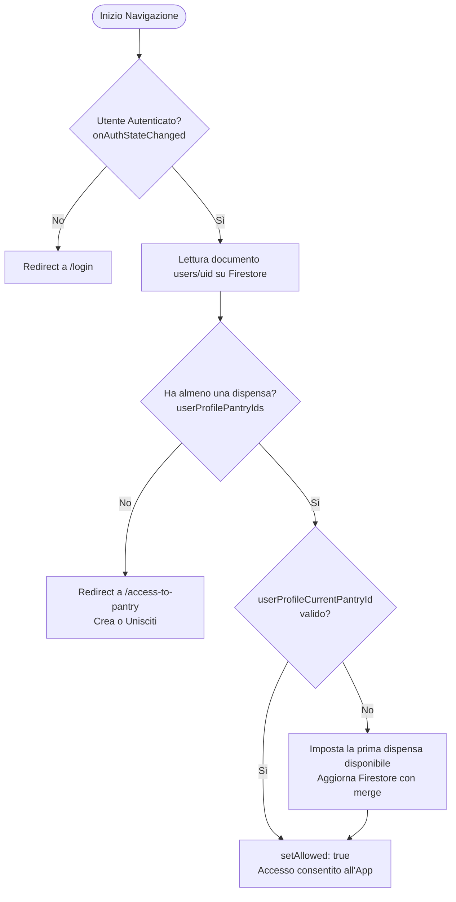

# PantryAI 🥗🤖

> **PWA mobile-first intelligente per la gestione della dispensa domestica, la lista della spesa collaborativa e la riduzione attiva dello spreco alimentare tramite intelligenza artificiale generativa.**

[](https://nextjs.org/)
[](https://react.dev/)
[](https://www.typescriptlang.org/)
[](https://firebase.google.com/)
[](https://genkit.dev/)
[](https://tailwindcss.com/)
[](https://github.com/serwist/serwist)
[](https://www.docker.com/)

---

## 📌 Indice dei Contenuti

1. [Visione & Contesto](#-visione--contesto)
2. [Caratteristiche Principali](#-caratteristiche-principali)
3. [Architettura del Sistema](#-architettura-del-sistema)
4. [Modello Dati Firestore (NoSQL)](#-modello-dati-firestore-nosql)
5. [Interfaccia Utente & Esperienza Mobile-First](#-interfaccia-utente--esperienza-mobile-first)
6. [Valutazione Sperimentale & Prestazioni](#-valutazione-sperimentale--prestazioni)
7. [Stack Tecnologico](#-stack-tecnologico)
8. [Struttura del Repository](#-struttura-del-repository)
9. [Guida all'Installazione & Avvio](#-guida-allinstallazione--avvio)
10. [Riferimenti Accademici & Crediti](#-riferimenti-accademici--crediti)

---

## 🌍 Visione & Contesto

Lo spreco alimentare domestico rappresenta una delle maggiori criticità globali in termini di sostenibilità ambientale ed economica. Secondo le stime della **FAO (Food and Agriculture Organization)**, circa un terzo di tutto il cibo prodotto nel mondo per il consumo umano va perduto prima di essere consumato.

In Italia, i dati ricavati dall'indagine nazionale del progetto **REDUCE (Ministero dell'Ambiente)** evidenziano che:
- Ogni cittadino spreca in media **530 grammi di cibo commestibile a settimana** (pari a oltre **27,5 kg all'anno per persona**).
- Sussiste un marcato **gap percettivo**: i consumatori tendono a sottostimare la propria quota di spreco reale fino a **cinque volte** rispetto a quanto effettivamente conferito nei rifiuti.

La causa principale risiede nella disattenzione durante l'acquisto e nella difficoltà di tenere traccia delle scadenze e delle giacenze reali in cucina. **PantryAI** risponde a questa sfida democratizzando l'accesso alla gestione intelligente della dispensa: una **Progressive Web App (PWA)** leggera, accessibile da qualsiasi smartphone senza vincoli da app store, capace di unire automazione ottica dei codici a barre, tracciamento collaborativo della spesa e modelli linguistici avanzati (**Google Gemini**) per suggerire ricette anti-spreco basate esclusivamente sugli alimenti disponibili.

---

## ✨ Caratteristiche Principali

### 🥑 1. Inventario Intelligente & Calcolo Shelf-life a Doppia Validità
- **Scadenza convenzionale vs Scadenza dinamica post-apertura**: oltre alla data di scadenza stampata sulla confezione (`expiryDateProduct`), PantryAI consente di contrassegnare un alimento come aperto. Il sistema ricalcola dinamicamente la durata di conservazione reale (`productOpenedExpiryAt = productOpenedAt + shelfLifeDays`).
- **Filtri avanzati e categorizzazione**: ricerca full-text istantanea, filtraggio per categorie merceologiche predefinite o personalizzate (Latticini, Carne, Pesce, Frutta, Verdura, Surgelati, ecc.), per stato di apertura e ordinamento temporale automatico in base all'urgenza di consumo.

### 📦 2. Riconoscimento Ottico Barcode & Integrazione Open Food Facts
- **Scanner da fotocamera ad alte prestazioni**: integrazione con `html5-qrcode` configurata a **60 fps** per una scansione ultra-reattiva dei formati standard del settore alimentare (**EAN-13**, **EAN-8**, **UPC-A**, **UPC-E**).
- **Recupero istantaneo dei metadati**: interrogazione dell'API pubblica di *Open Food Facts* con normalizzazione automatica dei dati (denominazione in italiano, marca e quantità).
- **Stima dell'impronta carbonica ($CO_2$)**: calcolo del costo ecologico del prodotto secondo la formula:
  $$\text{CarbonFootprint} = \text{quantity}_g \times \text{ecoscore\_data.agribalyse.co2\_total}$$

### 🛒 3. Lista della Spesa Collaborativa in Tempo Reale
- **Integrazione bidirezionale con l'inventario**: i prodotti esauriti possono essere inviati alla spesa con un singolo tocco.
- **Meccanismo di prenotazione anti-conflitto ("Lo compro io")**: ciascun membro del nucleo domestico può prenotare l'acquisto di un articolo (`reserved`), notificando gli altri membri e scongiurando acquisti duplicati.
- **Flusso Spesa Completata**: gli articoli acquistati (`purchased`) vengono confermati in blocco e reinseriti automaticamente nelle scorte dell'inventario.

### 🧑‍🍳 4. Chef AI: Assistente Culinario Generativo (Genkit + Gemini)
- **Generazione Anti-Spreco (Scadenza $< 7$ giorni)**: interroga l'inventario ed estrae gli alimenti prioritari prossimi alla scadenza, vincolando l'LLM alla generazione di ricette pratiche per consumare gli scarti imminenti.
- **Selezione Manuale Ingredienti**: modale dedicata per selezionare un sottoinsieme mirato di prodotti attualmente in giacenza da valorizzare.
- **Chatbot Conversazionale con Memoria**: assistente culinario interattivo che conserva lo storico dei messaggi scambiati e inietta in background il contesto reale della dispensa per risposte personalizzate.

### 📉 5. Tracciamento dello Spreco & Metriche di Sostenibilità
- **Classificazione ad albero decisionale**: al momento del decremento di un prodotto, l'utente specifica la motivazione:
  - **`consumed`**: consumo regolare con più di 3 giorni di anticipo rispetto alla scadenza.
  - **`rescued` (salvato)**: consumo *in extremis* (a meno di 3 giorni dalla scadenza). Quantifica il cibo effettivamente sottratto alla spazzatura e accredita la relativa quota di $CO_2$ risparmiata.
  - **`wasted` (sprecato)**: prodotto gettato oltre la scadenza, conteggiato negativamente nelle statistiche ambientali.
- **Dashboard dell'Impatto Ambientale**: monitoraggio visivo dei chilogrammi di cibo risparmiato e delle emissioni di $CO_2$ abbattute nel tempo.

### 👥 6. Architettura Multi-Dispensa & Permessi
- Possibilità di partecipare a più dispense contemporaneamente (casa principale, casa vacanze, coinquilini universitari).
- Invito rapido tramite **codice alfanumerico univoco a 6 caratteri**.
- Controllo accessi basato sui ruoli (`owner` ed `editor`), con un tetto massimo di salvaguardia di 10 membri per dispensa.

---

## 🏛 Architettura del Sistema

> 📊 **Diagramma Interattivo Runtime (Archify)**: È disponibile il [diagramma architetturale interattivo runtime](docs/architecture/tesi-runtime-architecture.html) con viste guidate su PWA Serwist, Server Actions Next.js, Cloud Firestore e flussi Google Genkit.

L'applicazione adotta una reinterpretazione moderna e scalabile del classico pattern **Model-View-Controller (MVC)**, ottimizzata per l'ambiente full-stack offerto da Next.js:



### Controllo Accessi & Instradamento (`AppGuard`)

L'integrità delle sessioni e la coerenza dello stato applicativo sono assicurate dal wrapper di protezione client-side `AppGuard.tsx`:



---

## 🗄 Modello Dati Firestore (NoSQL)

Il database NoSQL Cloud Firestore è stato progettato secondo un approccio **query-driven**, privilegiando la velocità di lettura, l'accesso diretto e la robustezza delle regole di sicurezza:

```
├── users/{userId}                          # Profili utente (email, nickname, photoURL)
│     ├── userProfilePantryIds: string[]    # Riferimenti alle dispense accessibili
│     └── userProfileCurrentPantryId: string# Dispensa correntemente visualizzata
│
├── pantries/{pantryId}                     # Dispensa domestica
│     ├── pantryName: string
│     ├── pantryOwnerId: string             # ID utente proprietario (amministratore)
│     ├── pantryInviteCode: string          # Codice di invito a 6 caratteri
│     ├── pantryCategories: string[]        # Categorie merceologiche abilitate
│     ├── pantryMembers: PantryMember[]     # Array di oggetti membri e ruoli (owner/editor)
│     │
│     └── history/{logId}                   # Sotto-collezione: Storico consumi e sprechi
│           ├── productId, productName
│           ├── quantityHistory: number
│           ├── resolution: 'consumed' | 'rescued' | 'wasted'
│           └── carbonFootprint: number     # Quota di CO2 associata
│
├── products/{productId}                    # Root collection inventario
│     ├── productPantryId: string           # Chiave di riferimento alla dispensa
│     ├── productName, productQuantity, productUnitOfMeasure
│     ├── expiryDateProduct: Timestamp      # Scadenza fissa della confezione
│     ├── productOpenedAt: Timestamp        # Data apertura
│     ├── productOpenedExpiryAt: Timestamp  # Scadenza ricalcolata post-apertura
│     ├── shelfLifeDays: number             # Giorni di validità da aperto
│     ├── productBarcode: string
│     └── carbonFootprint: number           # Impronta calcolata da Open Food Facts
│
└── shoppingListItems/{itemId}              # Root collection lista della spesa
      ├── listItemPantryId: string          # Chiave di riferimento alla dispensa
      ├── listItemName: string
      ├── listItemProductId?: string        # Collegamento al prodotto originale
      ├── listItemStatus: "toBuy" | "reserved" | "purchased"
      ├── listItemReservedBy?: string       # Membro che ha prenotato l'acquisto
      └── listItemPurchasedBy?: string      # Membro che ha spuntato l'articolo
```

### Regole di Sicurezza Firestore
Tutti gli accessi ai documenti sono isolati e protetti a monte tramite **Firebase Security Rules** (`firestoreCLI/firestore.rules`), impedendo manomissioni lato client e garantendo che le operazioni su `products`, `shoppingListItems` e `pantries/{id}/history` siano permesse solo agli effettivi membri della dispensa coinvolta (`isPantryMember`).

---

## 📱 Interfaccia Utente & Esperienza Mobile-First

L'applicazione è progettata seguendo rigorosamente il paradigma **Mobile-First**:

- **DownNavbar ergonomica**: posizionata nella parte inferiore dello schermo per un utilizzo naturale a una mano su display touch.
- **Pattern visivi di mitigazione dell'attesa**:
  - **Skeleton Screens**: componenti grafici animati che simulano la struttura degli elementi durante il fetching asincrono iniziale, azzerando la percezione di schermo vuoto.
  - **Indicatori di stato / Spinner**: feedback immediati per prevenire doppi tocchi accidentali durante le transazioni di scrittura o le chiamate verso l'LLM.

| Inventario & Scadenze | Scansione Barcode | Monitoraggio Spreco & CO2 | Chef AI Conversazionale |
| :---: | :---: | :---: | :---: |
| *Visualizzazione card prodotti con indicatori di freschezza* | *Scanner ottico fotocamera con rilevamento istantaneo* | *Calcolo quantitativo cibo salvato e emissioni evitate* | *Generazione ricette personalizzate con prompt anti-spreco* |

---

## 📊 Valutazione Sperimentale & Prestazioni

La valutazione empirica del prototipo ha analizzato in dettaglio tutti gli strati dell'architettura: tempi di rendering lato client, prestazioni del Service Worker, latenza del database Firestore, telemetria dell'LLM e tempi di risoluzione delle API esterne.

### 1. Tempi di Rendering: Cold Start vs Warm Start PWA

I test sono stati condotti mediante **Chrome DevTools** con profilazione di rete in tre scenari: Wi-Fi/Fibra, rete mobile 4G e connessione degradata (simulazione 3G/2G).

#### Tabella 4.1 – Metriche di rendering al primo caricamento senza cache (Cold Start)
| Rete simulata | TTFB | FCP | LCP | Reattività (FID / INP) |
| :--- | :---: | :---: | :---: | :---: |
| **Ottimale (Wi-Fi / Fibra)** | $\sim 1365\text{ ms}$ | $\sim 1448\text{ ms}$ | $\sim 3940\text{ ms}$ | $\sim 9.70\text{ ms}$ |
| **4G** | $\sim 1108\text{ ms}$ | $\sim 3728\text{ ms}$ | $\sim 9412\text{ ms}$ | $\sim 11.20\text{ ms}$ |
| **Rete scarsa (3G / 2G)** | $> 1200\text{ ms}$ | $> 5400\text{ ms}$ | $\sim 35568\text{ ms}$ | $\sim 96.00\text{ ms}$ |

*L'assenza di dati in cache su reti scarse evidenzia la necessità degli skeleton screen implementati per abbattere l'attesa percepita.*

#### Tabella 4.2 – Metriche di rendering a regime con Service Worker attivo (Warm Start PWA)
| Rete simulata | TTFB | FCP | LCP | Reattività (FID / INP) |
| :--- | :---: | :---: | :---: | :---: |
| **Ottimale (Wi-Fi / Fibra)** | **$\sim 311\text{ ms}$** | $\sim 1536\text{ ms}$ | $\sim 3580\text{ ms}$ | $\sim 7.10\text{ ms}$ |
| **4G / Rete scarsa (3G / 2G)** | **$\sim 311\text{ ms}$** | $\sim 1536\text{ ms}$ | $\sim 3580\text{ ms}$ | $\sim 7.60\text{ ms}$ |

*Grazie all'App Shell memorizzata dal Service Worker nella cache del dispositivo, il Time To First Byte (TTFB) si stabilizza a soli **311 ms** indipendentemente dalla qualità della connessione cellulare.*

### 2. Tempi di Risposta dell'Intelligenza Artificiale (Gemini 3.1 Flash Lite)
- Dati estratti tramite la **Developer UI di Firebase Genkit** e analisi dei trace distribuiti.
- La latenza per l'ottenimento della ricetta completa varia da un **minimo di $1.10\text{ s}$** a un **picco massimo di $4.09\text{ s}$** (media operativa ampiamente inferiore alla soglia di requisito non funzionale RNF-02.2 fissata a 7 secondi).

### 3. Latenza e Operazioni di Lettura su Cloud Firestore

Durante la sessione di collaudo sono state registrate oltre **4.300 operazioni di lettura**, **565 operazioni di scrittura** e **67 eliminazioni**, gestite con un picco di **6 connessioni attive e 6 listener snapshot in tempo reale**.

#### Tabella 4.3 – Latenza media e rapporto di scansione delle query Firestore
| Tipo di Query | Esecuzioni | Latenza Media | Documenti Scansionati / Risultati |
| :--- | :---: | :---: | :---: |
| `COLLECTION * SELECT __coll..` | 33 | 35 ms | 1.54 |
| `COLLECTION /pantries/*/* P..` | 3 | 27 ms | – |
| `COLLECTION /raccolta-test ..` | 6 | 26 ms | 1.00 |
| `COLLECTION /pantries SELECT..` | 34 | 20 ms | 1.18 |
| `COLLECTION /products/*/* P..` | 4 | 19 ms | – |
| `COLLECTION /shoppingListItems SELECT..` | 3 | 17 ms | 1.00 |
| `COLLECTION /raccolta-test/..` | 6 | 15 ms | – |
| `COLLECTION /products SELECT..` | 15 | 15 ms | **1.00** |
| `COLLECTION /users SELECT ..` | 18 | 14 ms | **1.00** |

*Un indice di scansione pari a **1.00** dimostra l'assenza di full-scan onerosi e l'efficacia del modello documentale indicizzato.*

### 4. Latenza API Esterne: Open Food Facts
- Tracciamento eseguito con `performance.now()` e archiviato in [`performance-data/openfoodfacts-latency.csv`](file:///Users/claudio/Documents/GitHub/PantryAI/performance-data/openfoodfacts-latency.csv).
- **Tempo medio di risoluzione barcode**: **$601.41\text{ ms}$**.
- Tempi in condizioni ottimali/4G: tra i $370\text{ ms}$ e i $600\text{ ms}$.
- Picchi massimi registrati in condizioni 3G/degradate: fino a $2542.90\text{ ms}$ (picco eccezionale $2911.10\text{ ms}$).

---

## 🛠 Stack Tecnologico

- **Frontend Core**: [Next.js 16.2.6](https://nextjs.org/) (App Router, Server Actions, Route Handlers), [React 19.2.4](https://react.dev/), [TypeScript 5](https://www.typescriptlang.org/)
- **PWA & Offline-First**: [@serwist/next](https://github.com/serwist/serwist) 9.5.11 (Service Worker, Cache API, manifest)
- **Styling & UI**: [Tailwind CSS v4](https://tailwindcss.com/), [Lucide React](https://lucide.dev/)
- **Backend as a Service**: [Firebase SDK v12](https://firebase.google.com/) (Cloud Firestore NoSQL, Firebase Authentication con OAuth2 / Google Sign-In, Firebase Security Rules)
- **Generative AI Framework**: [Google Genkit v1.39](https://genkit.dev/) (`@genkit-ai/google-genai`), modello predefinito **Gemini 3.1 Flash Lite**
- **Computer Vision / Barcode**: [html5-qrcode](https://github.com/mebjas/html5-qrcode) v2.3.8
- **Database Alimentare Aperto**: [Open Food Facts API v0](https://world.openfoodfacts.org/)
- **Containerizzazione & DevOps**: [Docker](https://www.docker.com/) (Multi-stage build Node 20 Alpine, output standalone), [Docker Compose](https://docs.docker.com/compose/)

---

## 📂 Struttura del Repository

```
├── app/                              # Next.js App Router (Pagine e Layout)
│   ├── (app)/                        # Gruppo di rotte protette con AppGuard
│   │   ├── AppGuard.tsx              # Wrapper di sicurezza e verifica dispense
│   │   ├── inventario/               # Gestione scorte e shelf-life
│   │   ├── lista-della-spesa/        # Lista collaborativa e acquisti
│   │   ├── ricette-ai/               # Chef AI e chatbot conversazionale
│   │   ├── spreco/                   # Dashboard metriche e impatto ambientale
│   │   └── profilo/                  # Gestione account e dispense
│   ├── access-to-pantry/             # Flusso creazione o join tramite codice
│   ├── login/                        # Autenticazione email e Google OAuth
│   └── redirect-login/               # Middleware trasparente sincronizzazione profilo
│
├── components/                       # Componenti modulari
│   ├── items/                        # Card prodotto, righe spesa, modale selezione AI
│   ├── layout/                       # DownNavbar, InventoryTopBar, ShoppingListTopBar
│   ├── monitoring/                   # Moduli per la registrazione delle performance
│   ├── popups/                       # BarcodeScannerPopup, ProductAddPopup, ProductEditPopup
│   ├── skeletons/                    # Skeleton screens per mitigazione attesa
│   └── ui/                           # Componenti base di interfaccia
│
├── firestoreCLI/                     # Configurazione Firebase CLI
│   ├── firestore.rules               # Regole di sicurezza granulari NoSQL
│   └── firestore.indexes.json        # Indici composti per le query
│
├── lib/                              # Servizi e logica applicativa
│   ├── api/                          # Client per Open Food Facts
│   ├── firebase.ts                   # Inizializzazione Firebase App, Auth e Firestore
│   ├── firestore/                    # CRUD Firestore (pantries, products, shopping, history)
│   ├── genkit/                       # Pipeline Genkit e prompt engineering Gemini
│   └── performance-logger.ts         # Logger CSV delle metriche prestazionali
│
├── performance-data/                 # Risultati sperimentali delle misurazioni
│   ├── db-latency.csv                # Benchmark latenze query Firestore
│   ├── openfoodfacts-latency.csv     # Benchmark latenze scansione Open Food Facts
│   └── rendering-metrics.csv         # Core Web Vitals su rete 4G
│
├── types/                            # Interfacce TypeScript del dominio
│   └── firestore/                    # Tipi per Utenti, Dispensa, Prodotti, Spesa, Storico
│
├── Dockerfile                        # Multi-stage Docker build per ambiente di produzione
└── docker-compose.yml                # Orchestrazione container locale (porta 3001:3000)
```

---

## 🚀 Guida all'Installazione & Avvio

### Prerequisiti
- **Node.js**: versione $\ge 20.x$
- **NPM**: versione $\ge 10.x$
- Progetto **Firebase** configurato (Authentication abilitata con Google e Email/Password, Cloud Firestore attivo)
- **Google Gemini API Key** (recuperabile da [Google AI Studio](https://aistudio.google.com/))

### 1. Clonazione del Progetto
```bash
git clone https://github.com/claudiofalcone03/PantryAI.git
cd PantryAI
git checkout Tesi
npm install
```

### 2. Configurazione delle Variabili d'Ambiente
Creare un file `.env.local` nella cartella root del progetto duplicando il modello fornito:
```bash
cp .env.example .env.local
```
Compilare i parametri necessari:
```env
# Firebase Client Configuration
NEXT_PUBLIC_FIREBASE_API_KEY=your_firebase_api_key
NEXT_PUBLIC_FIREBASE_AUTH_DOMAIN=your_project.firebaseapp.com
NEXT_PUBLIC_FIREBASE_PROJECT_ID=your_project_id
NEXT_PUBLIC_FIREBASE_STORAGE_BUCKET=your_project.firebasestorage.app
NEXT_PUBLIC_FIREBASE_MESSAGING_SENDER_ID=your_sender_id
NEXT_PUBLIC_FIREBASE_APP_ID=your_app_id

# Google Gemini / Genkit Configuration
GEMINI_API_KEY=your_gemini_api_key
GEMINI_MODEL=gemini-3.1-flash-lite
```

### 3. Esecuzione in Ambiente di Sviluppo (con HTTPS)
La fotocamera per lo scanner barcode e le funzionalità PWA richiedono un contesto sicuro (**HTTPS**):
```bash
npm run dev
```
L'applicazione sarà disponibile all'indirizzo `https://localhost:3000` (o `https://<ip-locale>:3000` dalla rete Wi-Fi per test diretti da smartphone).

### 4. Esecuzione con Docker & Docker Compose
Per eseguire l'istanza compilata e isolata in un container:
```bash
docker-compose up --build
```
Il servizio risponderà su `http://localhost:3001` (mappato sulla porta interna 3000 del container).

### 5. Verifica del Codice
```bash
# Controllo conformità ESLint
npm run lint

# Controllo statico dei tipi TypeScript
npm run typecheck

# Compilazione di produzione
npm run build
```

---

## 🎓 Riferimenti Accademici & Crediti

Il presente progetto costituisce il lavoro di tesi di laurea:

- **Istituzione**: [Politecnico di Bari](https://www.poliba.it/)
- **Dipartimento**: Dipartimento di Ingegneria Elettrica e dell'Informazione (DEI)
- **Corso di Laurea**: Corso di Laurea Triennale in *Ingegneria Informatica e dell'Automazione*
- **Disciplina**: *Ingegneria del Software e Fondamenti Web*
- **Titolo dell'Elaborato**: **PantryAI: Progettazione e Sviluppo di una PWA Intelligente per la Riduzione dello Spreco Alimentare Domestico**
- **Relatore**: Chiar.ma Prof.ssa Marina Mongiello
- **Laureando / Sviluppatore**: Claudio Vincenzo Falcone
- **Anno Accademico**: 2025–2026

---

## 📄 Licenza

Questo progetto è rilasciato per fini didattici e di ricerca accademica. Tutti i diritti appartengono all'autore.
